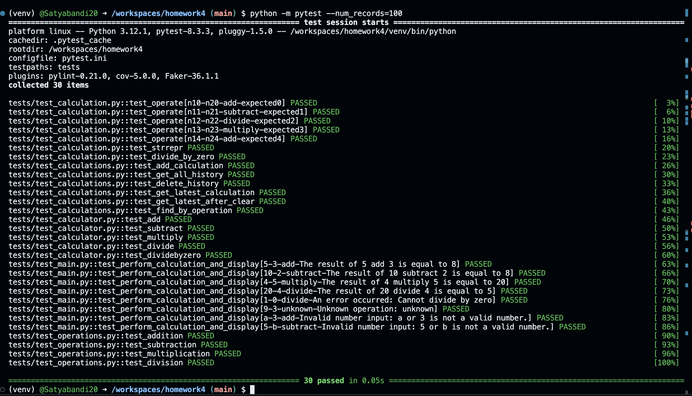

# Homework 4 - Calculator Application Faker

## Overview
This project enhances a simple calculator application by adding:
- **Faker** for generating test data
- **Automated test case generation** using `pytest --num_records=N`
- **Command-line interface (CLI)** for user input handling with exception management

## Features Implemented
### 1. **Faker for Test Data Generation**
- Installed `Faker` using:
  ```bash
  pip install faker
  ```
- Updated `requirements.txt` using:
  ```bash
  pip freeze > requirements.txt
  ```
- Used `Faker` in `tests/conftest.py` to generate test data dynamically.

### 2. **Automated Test Case Generation**
- Implemented `pytest --num_records=N` to generate and run `N` test cases automatically.
- Code added to `tests/conftest.py` to handle dynamic test generation.

### 3. **Command-Line Interface (CLI)**
- Added `main.py` to accept user input and perform calculations.
- Implemented error handling for:
  - Invalid inputs (e.g., non-numeric values)
  - Division by zero
  - Unknown operations
- CLI usage example:
  ```bash
  python main.py 5 3 add
  ```

## **Installation Instructions**
1. Clone the repository:
   ```bash
   git clone https://github.com/Satyabandi20/homework4.git
   cd homework4
   ```
2. Create and activate a virtual environment:
   ```bash
   python -m venv venv
   source venv/bin/activate  # macOS/Linux
   venv\Scripts\activate  # Windows
   ```
3. Install dependencies:
   ```bash
   pip install -r requirements.txt
   ```
4. Verify installation:
   ```bash
   pip list
   ```

## **How to Run Tests**
- Run `pytest` with automated test generation:
  ```bash
  pytest --num_records=100
  ```
- Run `pytest` with linting and coverage:
  ```bash
  pytest --pylint --cov
  ```

## **How to Use the CLI**
To run calculations via command line :
```bash
python main.py <num1> <num2> <operation>
```
Example:
```bash
python main.py 5 3 add
```

## **Branching Strategy for Assignment Submission**
1. **faker branch** - Added Faker for test data generation.
2. **command branch** - Added CLI handling (`main.py`, `test_main.py`).
3. **main branch** - Merged final working solution (all features integrated).

## **Submission Instructions**
- All changes have been merged into `main`.
- The repo link to be submitted: [GitHub Repository](https://github.com/Satyabandi20/homework4)
- **Test Logs Screenshot:**  
  

---

## **Grading Breakdown**
✅ **30 Points - Faker** (Test data generation implemented)  
✅ **30 Points - Test Data Generation** (Automated test cases using `pytest --num_records`)  
✅ **40 Points - User Input Handling** (CLI handling in `main.py`)  

---

### **Instructor References**
- Faker Library Documentation: [Faker Docs](https://faker.readthedocs.io/)
- Pytest Documentation: [Pytest Docs](https://docs.pytest.org/)
- CLI Exception Handling: [Python Docs](https://docs.python.org/3/tutorial/errors.html)

---

This README provides complete information about the assignment, installation, and testing process.
